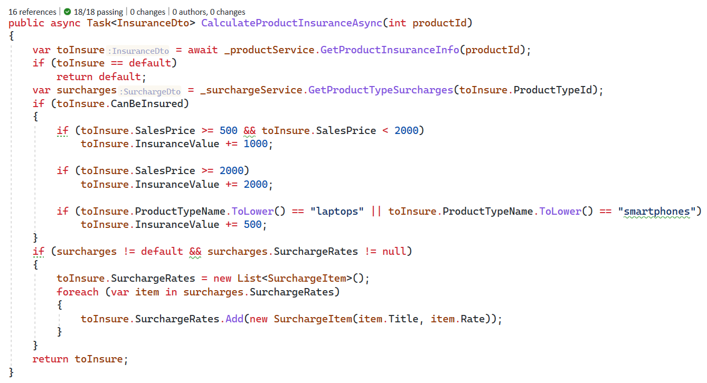
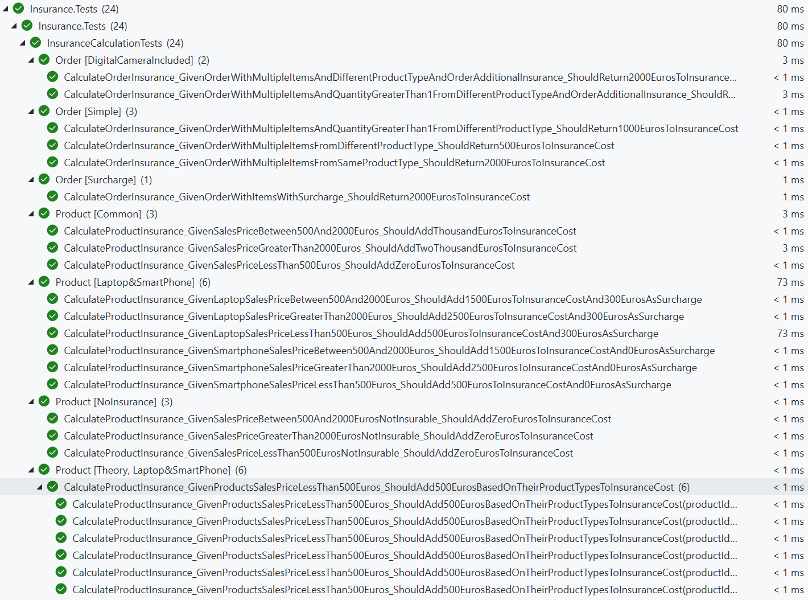

# Software Development Assignment
✅All five tasks are done.
✅The [live demo](https://cb.mesbahi.net/swagger/index.html) can be found [here](https://cb.mesbahi.net/swagger/index.html)!
  

## Used Technologies:

-  **Development:** .NET 6.0.4, C# 10

-  **Storage:** SQLite

-  **Testing:** XUnit, Moq

  

## How to run:

-  ```dotnet tool install --global dotnet-ef```

-  ```dotnet ef migrations add "InitDatatbase" -o "Data/Migrations" -c "InsuranceDbContext" -p .\src\Insurance.Api\Insurance.Api.csproj```

-  ```dotnet run```

---

## Documentation:

### ⚠️ **Business features and technical implementations have been done considering the size of the project and about 10 hours given time.**

  

### 📐 Architecture:

- SOLID, SoC, design principles are considered based on project size and time. For example, in this size and complexity of the project, it's better to separate things using namespaces and folders rather than creating several projects with one or less than five files. Also, I believe that using libraries and tools could be a good approach when they bring value-added to our project or make our code more maintainable. Keeping the code simple but structured and preventing unnecessary complexities was a goal of this project.

- In this project, I've implemented the following functionalities as services to reduce coupling and improve testability:
   -   **ProductService:** this service provides the data from the given ```ProductData.Api``` service, I mock this in my tests to get static data to other services
   - **SurchargeService** Surcharge data is stored in an SQLite database as a portable, open-source, fast data store, so this service has **required** functionalities to save and get surcharge data. Changing this database with other alternatives such as SQL Server, PostgreSQL, and MySQL is simple because it needs only to implement the service interface into a new provider class and replace this with the DI.
   - **InsuranceCalculationService** This is the core service and the most critical part of the assignment; why? Because other services have general functionalities like CRUD or REST calls, but business-logic of the application is encapsulated in this one. Calculating insurance, additional insurance fees, and the surcharges are staying in this service. So, I decided to cover this service with various tests (now 24 tests) within the given time. This service needs the other two services, and for better maintainability, testability, and reduce coupling all of them glue together with interfaces and DI. As you can see in the following image, the business logic is hardcoded in ```CalculateProductInsuranceAsync``` method. We should design this part within more dynamic and customizable structures such as a rule engine or conditional builder in real-world scenarios.



### 🧪 Testing:
Quality and testing are inseparable; I had to decide about the depth and domain of testing; regarding this project's requirements, I've developed tests to cover different combinations of products and product types to cover surcharges and additional order insurances, and all insurance calculation rules.
All required services and dependencies are mocked using fixtures and mock setups.




### 🚀 Review Meeting:
If we go through the assignment review meeting, I will talk in detail about the project structure, the reason behind each decision, the differences between this project size, and real-world considerations, such as:
Using caching mechanism for the data comes from external APIs (ProductData.API)
Implement poly library for retry policies in case external API doesn't respond.
Using object mappers for DTOs and domains in case of implementing all features and increasing the number of objects
Rule engine and the conditional builder design for the insurance rules, surcharges, and additional insurance costs.

